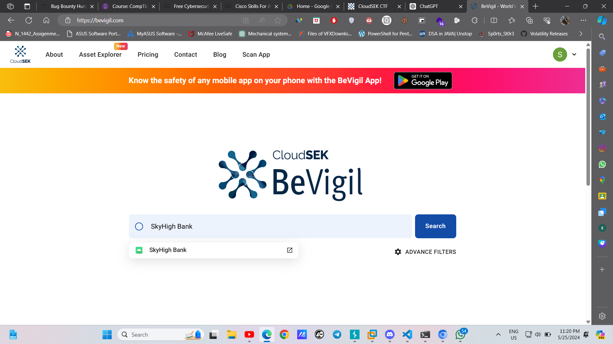
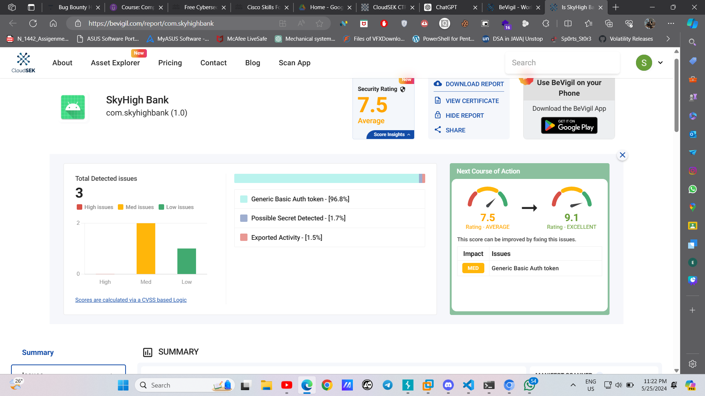
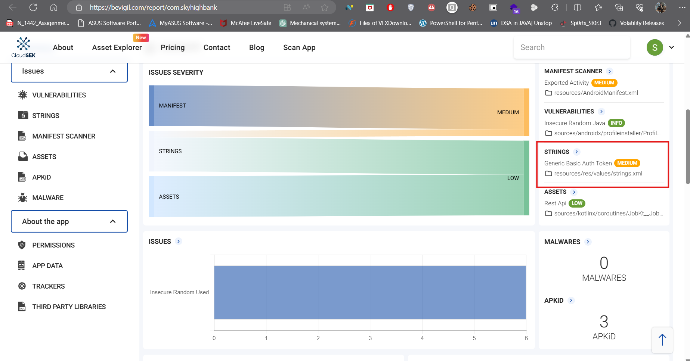
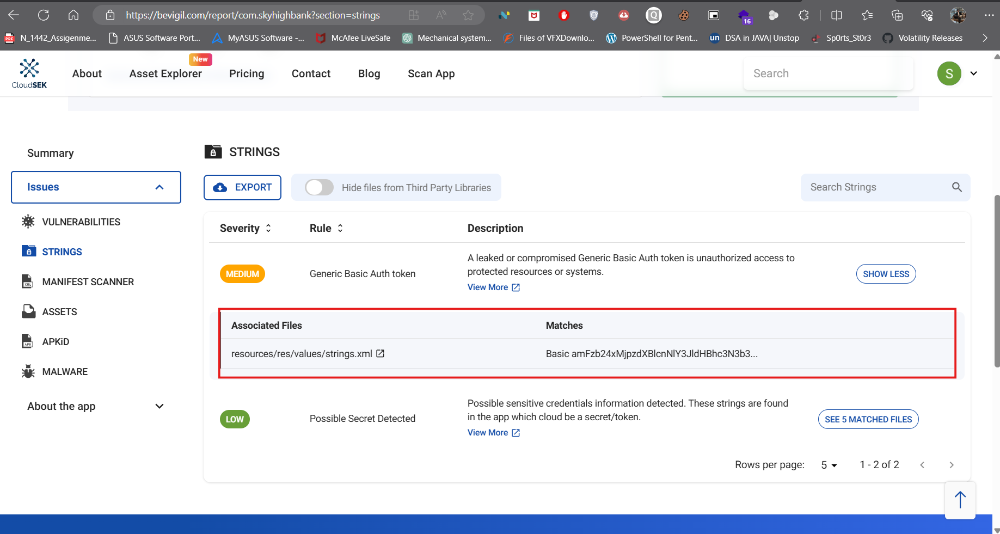
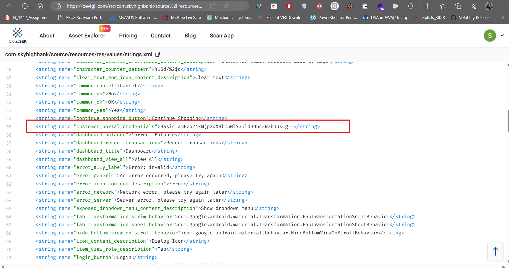
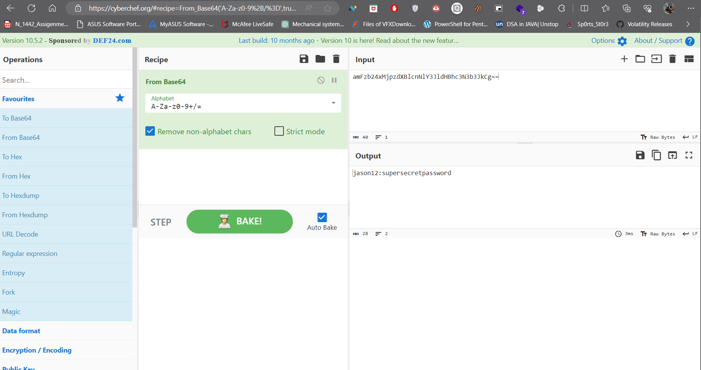

**Challenge Name : CSK-05-2024: Introduction**
Points: 50 Pt.

**Description** :
                As a security researcher at CloudSEK, Your team has received intelligence about SkyHigh Bank getting breached due to exposure of sensitive credentials. The HUMINT engagement done by the Threat Intelligence team of CloudSEK revealed the IAV (Initial Attack Vector) to be the official mobile application associated with the SkyHigh Bank named SkyHigh Bank.

For your convenience, The mobile application is already uploaded on BeVigil (bevigil.com) for analysis.

Your task is to identify the exposed credentials that led to the data breach. The flag value is the username of the person whose credentials got compromised.

**Steps to Solve** :
                
Step 1: Read the description carefully. This is a MISC category challenge where they provide some hints about their product and where the attack is performed. The credentials of the users are revealed, and our task is to find the username of the compromised account. Focus on the bank named "SkyHigh Bank."

Step 2: We have to visit bevigil.com. After that, log in to the portal for complete access, and in the search box, search for the bank name given in the description.

Step 3: In the image, we see there is an Android application already scanned. Visit it and take a look at all the files present in the APK. Let's check the strings section.

Step 4: In the strings section, we have two severity folders: one is medium and the other is low. By looking at the medium folder, we are able to see a strings.xml file and some strings in front of it. Let's open it. 

                

Boom! We got some Base64 strings. Let's decode them.
We got the username and password.

**flag == CSK-05-2024{jason12}**
