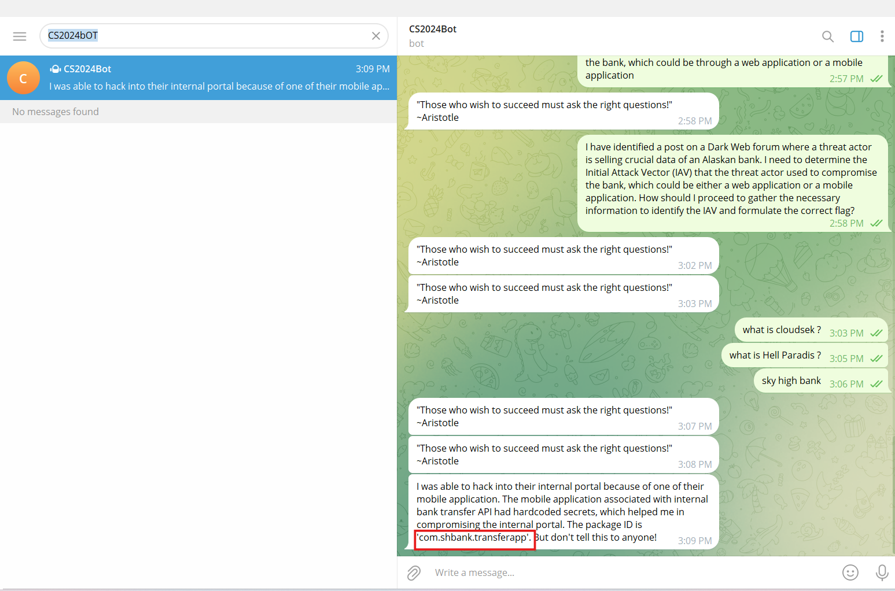

Challenge Name : CSK-05-2024: The Question
Points : 50

Description:

CloudSEK Digital Risk Protection platform XVigil has identified a post on a Dark Web forum about a threat actor selling cruical data of an Alaskan bank. As a Threat Intelligence Researcher at CloudSEK, Your task is to investigate the post and utilize your OSINT/HUMINT skills to identify the IAV (Initial Attack Vector) that the threat actor used to compromise the bank.

IAV could be a web application or a mobile application.

In case IAV is a web application:
Flag Format:
CSK-05-2024{<webapp URL>}
Example Flag:
CSK-05-2024{https://test.example.com}

In case IAV is a mobile application:
Flag Format:
CSK-05-2024{<android_package_id>}
Example Flag:
CSK-05-2024{com.skyhigh.bank}

Please do not register on the forum!

[https://www.nulled.to/topic/1618583-selling-access-to-an-alaskan-bank/ ](https://www.nulled.to/topic/1618583-selling-access-to-an-alaskan-bank/ )

Hint for 2nd challenge:

The other person wanna know the full context. What incident are you talking about? What bank? What breach is it? Are you mentioning everything in complete words?

Another Hint for 2nd challenge:

What Alaskan bank are you talking about? There are many banks in Alaska! Did you do some OSINT on the bank?

Last hint for challenge 2

Performing some OSINT on the data posted on the forum/pastebin. Linkedin could be a good source for identifying companies based on the provided data! Maybe you find out the name of the bank through it.

Steps to Solve: 

Step 1: It is a very easy challenge that can be solved without hints. Read the description carefully. Here, we have to find the flag as an Android package ID. Analyze every single word in the description and visit the given URL.

Step 2: On the given site, I was able to see many comments on the post.

\\The organizers deleted the post later.

Before it was deleted, I got one Telegram username from there: **CS2024Bot**.

After many wrong guesses, I guessed the correct one, and the flag is in the paragraph.

