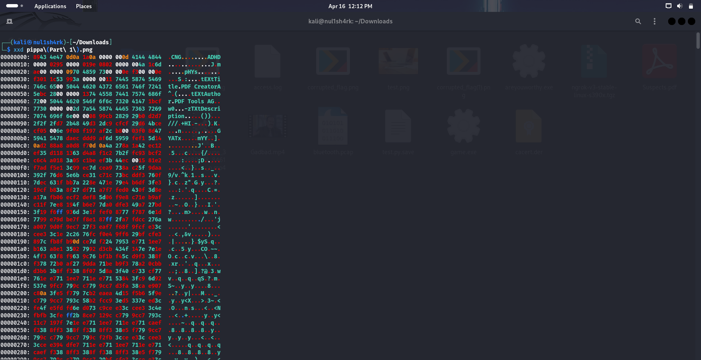

__Challenge Name : BIBBA 1__

Category : Forensics

Difficulty : Easy

Points : 200

Author : Samarth Kamble aka {__Nul1Sh4rk__}

Description : my grandfather sent me this one photo describing it as his one of the most cherised and sacred memories during his time. help me find out some details about it. part 1: png header error, after solving flag would be printed on the photo.
Attachment : .png>)

This is a really easy challenge. In order to confuse players, they created a red herring by changing a PNG header to CNG. However, we don't need to modify the header; we can simply search for the flag using grep.

