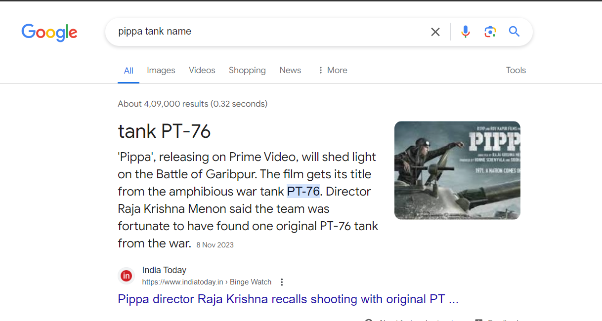

__Challenge Name : BIBBA 2__

Category : OSINT

Difficulty : Easy

Points : 200

Author : Samarth Kamble aka {__Nul1Sh4rk__}

Description : now that you can see the photo, its obvious that its from a wartime assault, can u find me: a)Name of the Battle, b) What tank is that? Flag format: if the battle name is 'battle of stalingrad' and tank name is T-99 then the flag is: 0CTF{Battle_of_Stalingrad_T99} PS: refer to the image extracted from BIBBA 1

This is an easy OSINT challenge. Our goal is to find the battlefield and the tank used in that battle. As a clue, they mention referring to the image of BIBBA 1. The filename of the attached BIBBA 1 file, Pippa (Part 1), might be a helpful hint after some Googling I found name of tank and Battlefield.

Flag : 0CTF{Battle_of_Garibpur_PT76}
