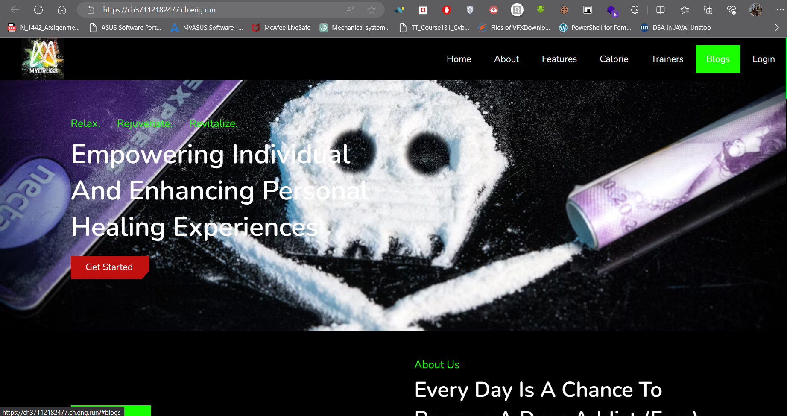
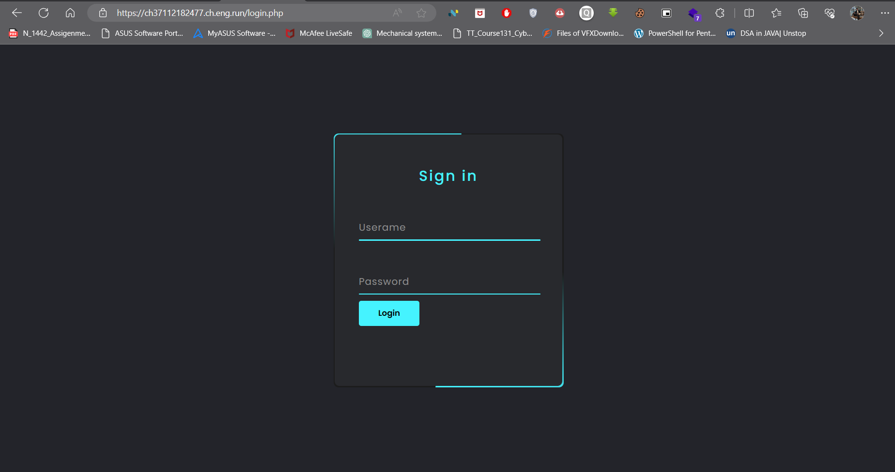
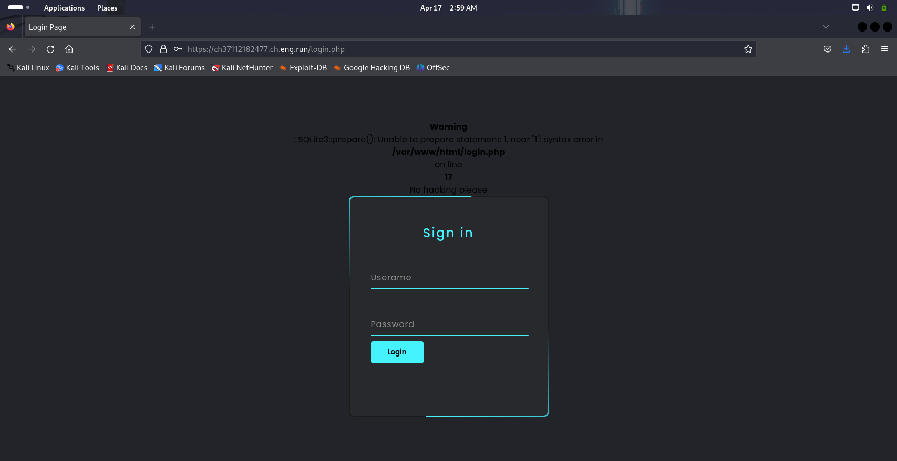
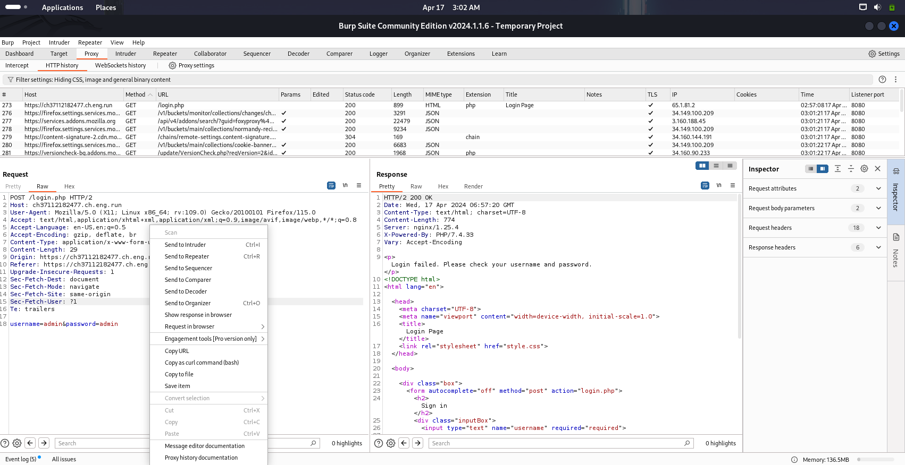

__Challenge Name : Drug Injection__

Category : Web

Difficulty : Hard 

Points : 300

Author : Samarth Kamble aka {__Nul1Sh4rk__}

DESCRIPTION : I made a Drug awareness website for my Drug Addict friend as a joke to help him get over his addiction. He kept complaining about not being able to login. He Scored an injection drug. I tried to convince him that he should stop getting High before he tries to login. injections won't always help u to get HIGHer access. He was not satisfied with just a single injection, he wanted to try Double Dose. How do I convince him to stop. Help me spread awareness.

They provided us with a website that offers various functionalities, but the main feature appears to be the login page.

According the challenge name we have to perfom a injection attack means SQL injection.





Here I performed a simple error boolean based injection attack and got a error.

```python
'1=1 --'
```



Now I'll capture this burp request and save as a file.




Now using "sqlmap" let's dump all tables and databases Using this this simple command 
```python
sqlmap -r sql --batch  --dump-all
```


And Here is the Flag 

0CTF{3l3v4ting_Y0ur_SQL_1njection_G4m3_T0_Th3_N3xt_L3v3l}


