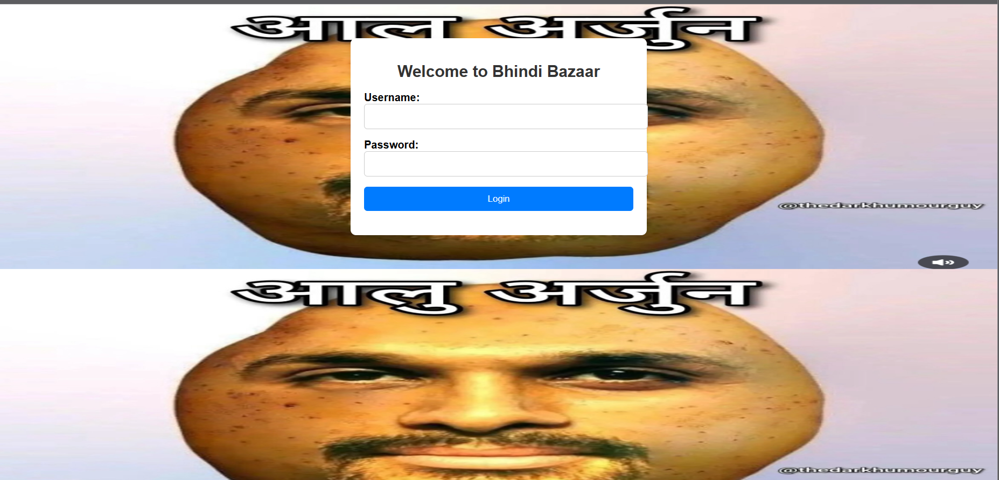
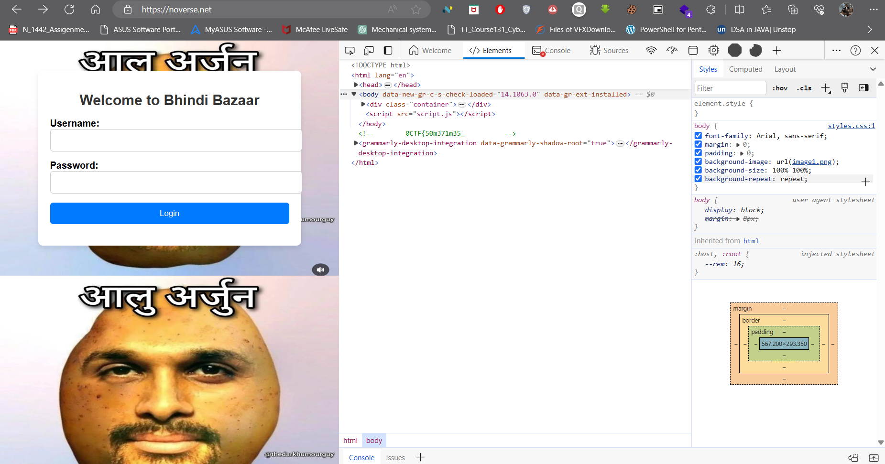
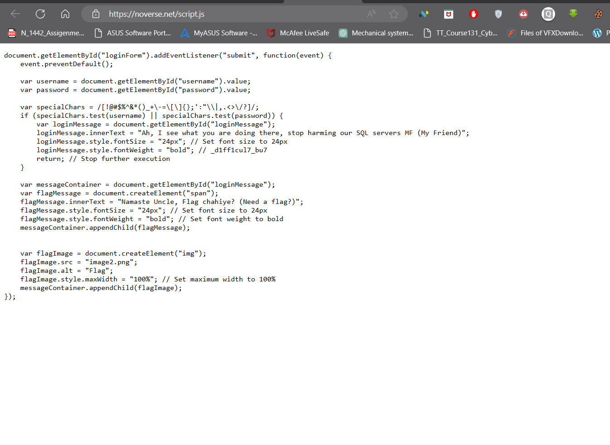
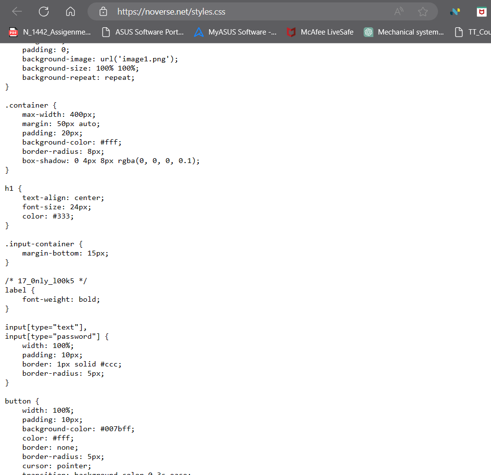
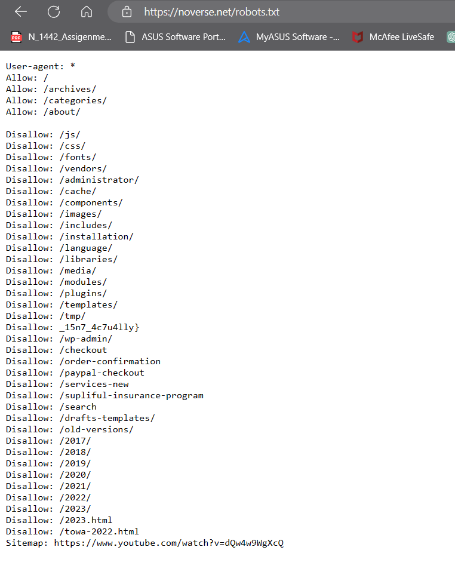

__Challenge Name : Gumm Ho Gaya Hu__

Category : Misc

Difficulty : Easy 

Points : 50

Author : Samarth Kamble aka {__Nul1Sh4rk__}

DESCRIPTION : 

Hello, my friends, this is yo boi Snip3R straight outta P-town, here we go another web challenge from me, saw your rants and thought of creating an EZPZ challenge for ya'll (maybe). So here you go, solve this ez web based chall currently introduced to misc section COZ WHY NOT.

Mai jo guum hogaya hu inn aankho me jaan, Don't you know bout mah love, ye an bewafa, Tere fizao me mai khoya reheta hu, Sab dil ki baate, tujhi se meri jaan (that was just rubbish nothing related to the challenge ~ maybe)

A bit to describe, you ain't getting da whole flag in a single go, so keep hunting like my sweet little child. 💋

[Challenge Link!](https://noverse.net/)

In this challenge author gave us a simple login page with aloo arjun image 



Step 1 : Inspect the page there is a first part of flag.
```python
0CTF{50m371m35_
```


Step 2 : Take a look at script.js
```python
_d1ff1cul7_bu7
```


Step 3 : Third part is hidden in style.css
```python

17_0nly_l00k5
```



Step 4: Take look of robots.txt
```python
_15n7_4c7u4lly}
```




